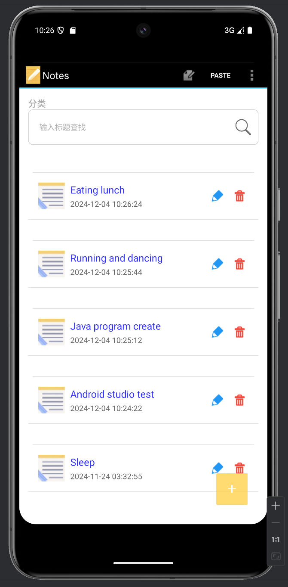
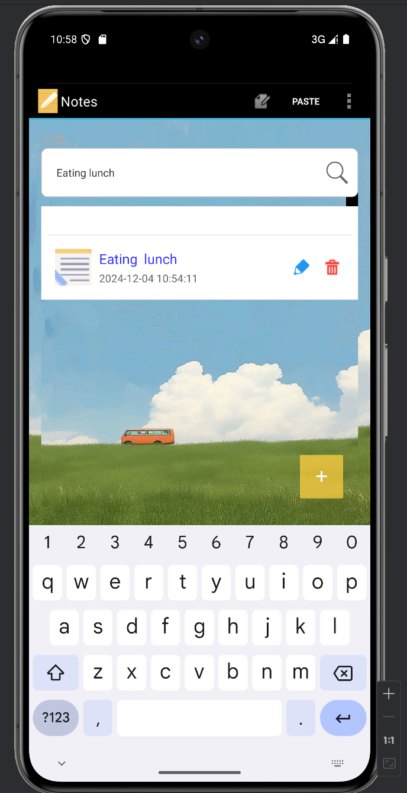
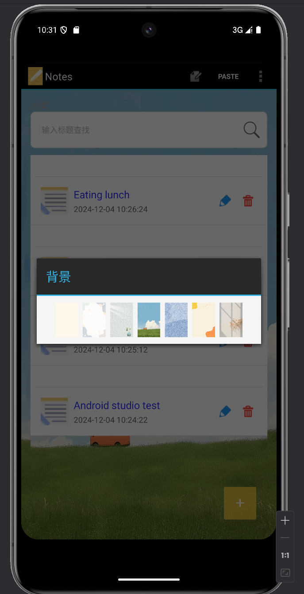
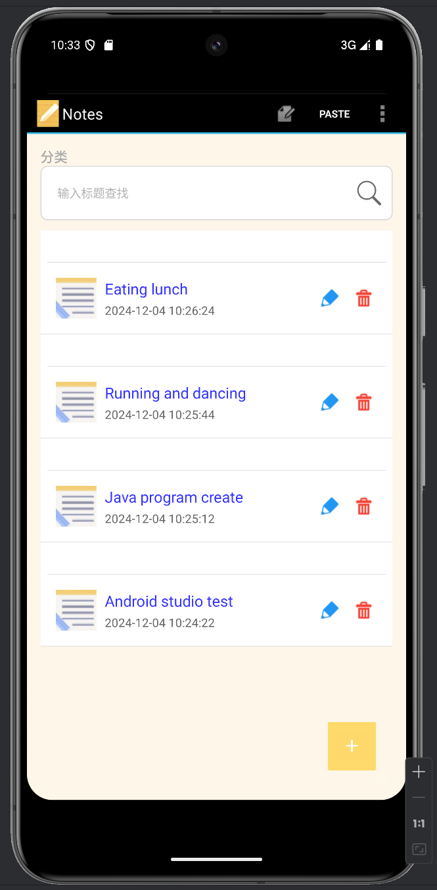
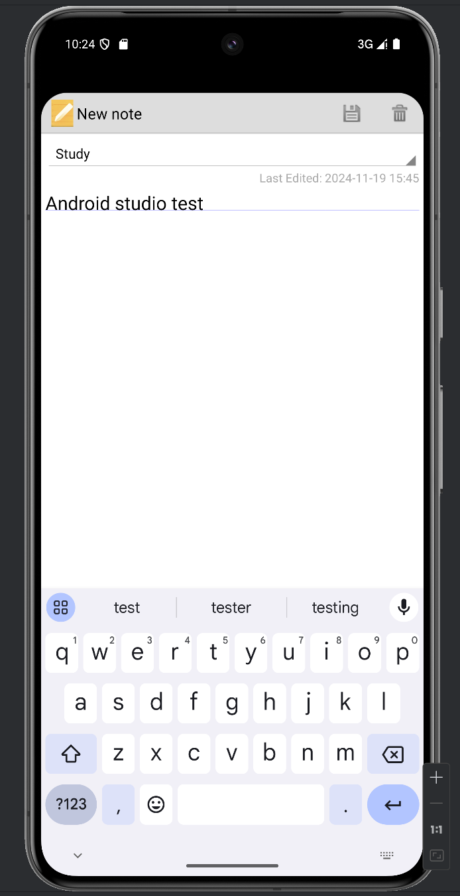
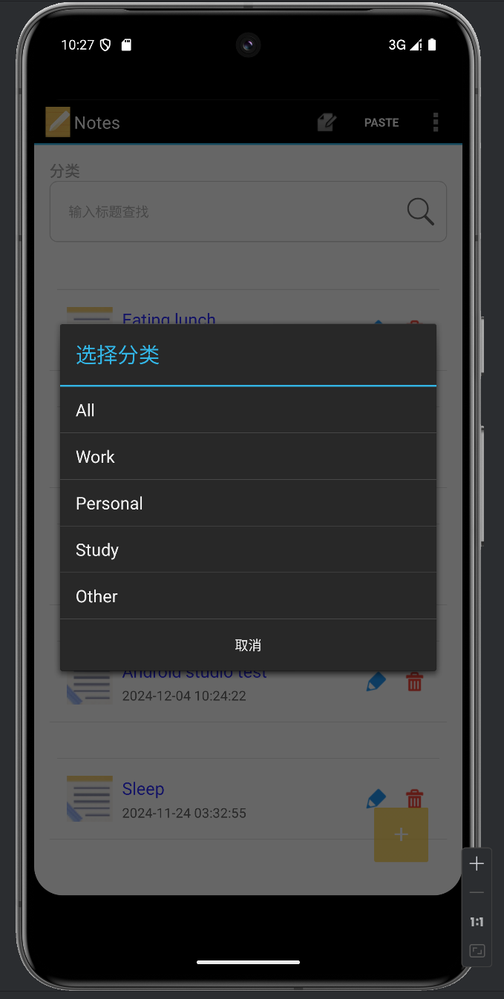
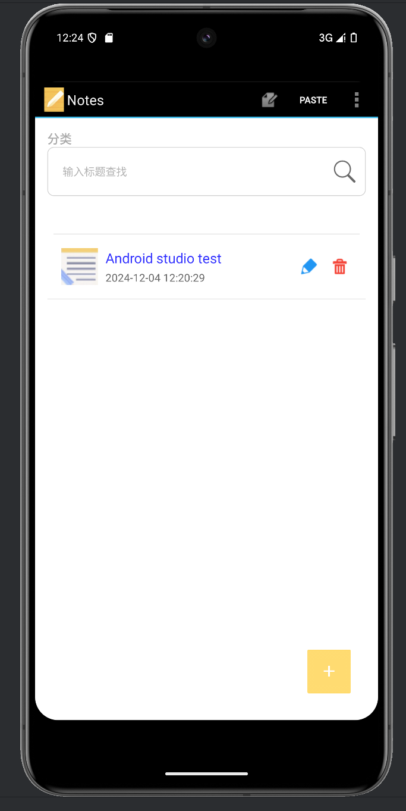

---

# MyNotePad 项目功能说明

## 一. 项目设计思路

1. **核心目标**：打造一个轻量化、功能实用的记事本应用，重点解决用户日常记录的便捷性和管理效率问题。
2. **主要功能模块**：
    - **基础功能**：实现笔记的创建、编辑、删除等基本操作。
    - **时间显示**：记录笔记的创建时间，帮助用户按时间梳理信息。
    - **快速检索**：支持关键字搜索，提升笔记查询效率。
    - **分类管理（扩展）**：通过对笔记分类分组，优化笔记管理逻辑。
    - **个性化界面（扩展）**：提供主题切换功能，增强用户体验。
3. **用户需求分析**：
    - 用户希望快速记录信息，避免复杂交互。
    - 笔记数量较多时需要高效检索和分类功能。
    - 界面风格需简洁清晰并具备一定的美化选项。
4. **技术选型与实现**：
    - 数据存储：使用 SQLite 数据库保存笔记数据。
    - 界面交互：基于 Android 原生 UI 元件实现动态布局与功能绑定。
    - 模块化开发：将功能拆分为独立模块，易于维护和扩展。

---

## 二. 项目功能实现

### 1. **时间戳显示**
- **功能描述**：在笔记列表中直观展示每条笔记的创建时间，便于用户查看记录时间。
- **实现思路**：
    - 在数据库中保存每条笔记的创建时间戳。
    - 使用工具类将时间戳转换为标准时间格式显示在笔记列表中。
- **核心代码**：
  ```java
  public class DateUtil {
    public static String StringToDate(String str_data)
    {
        String beginDate=str_data;
        SimpleDateFormat sdf=new SimpleDateFormat("yyyy-MM-dd HH:mm:ss");
        String sd = sdf.format(new Date(Long.parseLong(beginDate)));
        return  sd;
    }}
  ```
- **效果展示**：
    - 笔记列表每条记录下方显示对应时间，清晰明确。

**截图展示**：  


---

### 2. **笔记查询功能**
- **功能描述**：用户可通过标题或内容关键字搜索，快速定位目标笔记。
- **实现思路**：
    - 在笔记适配器中添加动态过滤逻辑，根据用户输入实时刷新结果。
    - 搜索框绑定监听器，捕捉输入内容并触发适配器搜索方法。
- **核心代码**：
  ```java
  public void Search(String searchTitle){
        searchData=new ArrayList<NoteBean>();
        for(NoteBean noteBean:mDate){
            if(noteBean.getTitle().indexOf(searchTitle)!=-1){
                searchData.add(noteBean);
            }
        }
        mDate.clear();
        mDate.addAll(searchData);
        notifyDataSetChanged();
    }
  ```
- **效果展示**：
    - 在搜索框中输入关键字，列表动态更新显示符合条件的笔记。

**截图展示**：  


---

### 3. **UI 美化（扩展）**
- **功能描述**：支持用户选择不同主题，优化界面视觉体验。
- **实现思路**：
    - 提供主题切换功能，通过点击不同颜色选项动态改变背景色。
    - 统一设计主题样式，优化界面字体和按钮风格。
- **核心代码**：
  ```java
  private  void showpopSelectBgWindows(){
        LayoutInflater inflater = LayoutInflater.from(this);
        View view = inflater.inflate(R.layout.dialog_bg_select_layout, null);
        AlertDialog.Builder builder = new AlertDialog.Builder(this);
        builder.setTitle("背景");//设置标题
        builder.setView(view);
        AlertDialog dialog = builder.create();//获取dialog
        dialog.show();//显示对话框
    }
  ```
  - 自定义主题样式：
  ```xml
  <string name="background">Theme</string>
  ```
  ```xml
  <ImageView
        android:layout_width="40dp"
        android:layout_height="60dp"
        android:layout_margin="4dp"
        android:id="@+id/zero"
        android:background="@drawable/img_6"
        android:contentDescription="@null"
        android:onClick="ColorSelect" />
  ```
 - 背景改变监听器：
 ```java
  public void ColorSelect(View view){
    String color;
    switch(view.getId()){
        case R.id.zero:

            Drawable btnDrawable1 = getResources().getDrawable(R.drawable.img_6);
            ll_noteList.setBackgroundDrawable(btnDrawable1);
            lv_notesList.setBackgroundDrawable(btnDrawable1);

            break;
        case R.id.one:
            Drawable btnDrawable2 = getResources().getDrawable(R.drawable.img_5);
            ll_noteList.setBackgroundDrawable(btnDrawable2);
            lv_notesList.setBackgroundDrawable(btnDrawable2);
            break;
        case R.id.two:
            Drawable btnDrawable3 = getResources().getDrawable(R.drawable.img_4);
            ll_noteList.setBackgroundDrawable(btnDrawable3);
            lv_notesList.setBackgroundDrawable(btnDrawable3);
            break;
        case R.id.three:
            Drawable btnDrawable4 = getResources().getDrawable(R.drawable.img_3);
            ll_noteList.setBackgroundDrawable(btnDrawable4);
            lv_notesList.setBackgroundDrawable(btnDrawable4);
            break;
        case R.id.four:
            Drawable btnDrawable5 = getResources().getDrawable(R.drawable.img_2);
            ll_noteList.setBackgroundDrawable(btnDrawable5);
            lv_notesList.setBackgroundDrawable(btnDrawable5);
            break;
        case R.id.five:
            Drawable btnDrawable6 = getResources().getDrawable(R.drawable.img_1);
            ll_noteList.setBackgroundDrawable(btnDrawable6);
            lv_notesList.setBackgroundDrawable(btnDrawable6);
            break;
        case R.id.six:
            Drawable btnDrawable7 = getResources().getDrawable(R.drawable.img);
            ll_noteList.setBackgroundDrawable(btnDrawable7);
            lv_notesList.setBackgroundDrawable(btnDrawable7);
            break;
    }

}
  ```

- **效果展示**：
    - 用户可自由选择背景颜色，应用界面更加美观、个性化。

**截图展示**：  




---

### 4. **笔记分类功能（扩展）**
- **功能描述**：用户可为笔记添加分类标签，并按分类筛选笔记。
- **实现思路**：
    - 数据库扩展：在笔记表中新增分类字段。
    - 分类选择：在笔记编辑界面中添加下拉菜单，允许用户设置分类。
    - 分类筛选：在笔记列表页添加分类筛选选项，动态加载选定分类的笔记。
- **核心代码**：
    1. **数据库扩展**：
    - 添加category字段：
       ```java
       @Override
        public void onCreate(SQLiteDatabase db) {
            // 创建表时的SQL语句
            db.execSQL("CREATE TABLE " + NotePad.Notes.TABLE_NAME + " ("
                    + NotePad.Notes._ID + " INTEGER PRIMARY KEY,"
                    + NotePad.Notes.COLUMN_NAME_TITLE + " TEXT,"
                    + NotePad.Notes.COLUMN_NAME_NOTE + " TEXT,"
                    + NotePad.Notes.COLUMN_NAME_CREATE_DATE + " INTEGER,"
                    + NotePad.Notes.COLUMN_NAME_MODIFICATION_DATE + " INTEGER,"
                    + NotePad.Notes.COLUMN_NAME_CATEGORY + " TEXT" // 新增分类字段
                    + ");");
        }
       ```
    2. **分类筛选逻辑**：
       - 在 NoteList 类中，筛选笔记并更新显示：
       ```java
       private void filterNotesByCategory(String category) {
        Cursor cursor;

        if ("All".equals(category)) { // 修改为统一的英文分类名
            // 如果选择的是“全部”，查询所有笔记
            cursor = getContentResolver().query(
                    NotePad.Notes.CONTENT_URI,  // 笔记的 URI
                    PROJECTION,                // 查询的列
                    null,                      // 无筛选条件
                    null,                      // 无筛选参数
                    null                       // 默认排序
            );
        } else {
            // 如果选择的是某个具体分类
            String selection = NotePad.Notes.COLUMN_NAME_CATEGORY + "=?";
            String[] selectionArgs = new String[]{category};

            cursor = getContentResolver().query(
                    NotePad.Notes.CONTENT_URI,  // 笔记的 URI
                    PROJECTION,                // 查询的列
                    selection,                 // 筛选条件
                    selectionArgs,             // 筛选参数
                    null                       // 默认排序
            );
        }

        if (cursor != null) {
            // 使用查询结果更新界面
            adapter.changeCursor(cursor); // 替换 mAdapter 为 adapter
        }}
       ```
       - 显示分类对话框：
       ```java
       private void showCategoryFilterDialog() {
        AlertDialog.Builder builder = new AlertDialog.Builder(this);
        builder.setTitle("选择分类");

        // 分类选项，与 strings.xml 中的分类选项保持一致
        final String[] categories = getResources().getStringArray(R.array.note_categories);

        builder.setItems(categories, new DialogInterface.OnClickListener() {
            @Override
            public void onClick(DialogInterface dialog, int which) {
                // 获取选择的分类
                String selectedCategory = categories[which];

                // 更新笔记列表显示
                filterNotesByCategory(selectedCategory);
            }
        });

        builder.setNegativeButton("取消", null);
        builder.show();
       }
       ```
- **效果展示**：
    - 用户可为每条笔记选择分类，并通过筛选器查看同一分类下的所有笔记。

**截图展示**：  





---

## 三. 关键技术细节
1. **数据存储**：使用 SQLite 存储笔记数据，支持 CRUD 操作及扩展字段。
2. **动态适配器**：通过自定义适配器，灵活实现列表的动态更新。
3. **界面交互优化**：通过监听用户操作（点击、输入等）实现快速响应。

---

## 四. 项目亮点与扩展方向

### 1. 项目亮点
- **功能实用**：覆盖用户记事本的核心需求（记录、查询、分类管理）。
- **操作流畅**：界面简单直观，交互逻辑清晰。
- **高扩展性**：采用模块化设计，便于后续功能扩展。

### 2. 后续优化方向
- **数据安全**：增加笔记加密功能，保护用户隐私。
- **云端同步**：支持笔记数据云端存储与同步功能，实现多设备共享。

---
